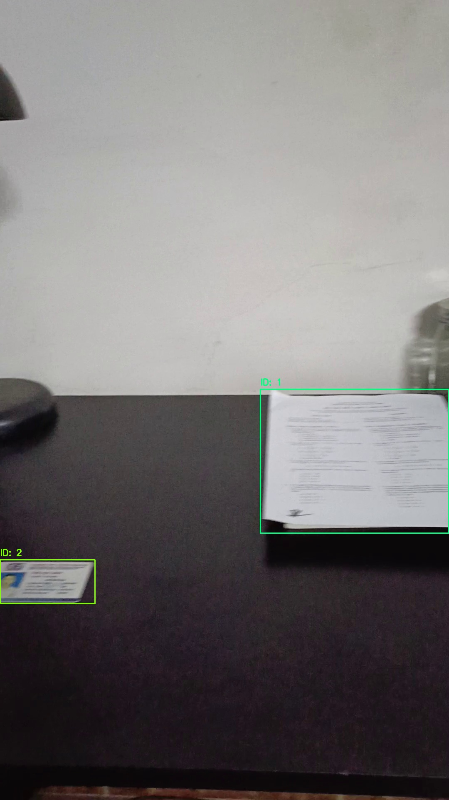
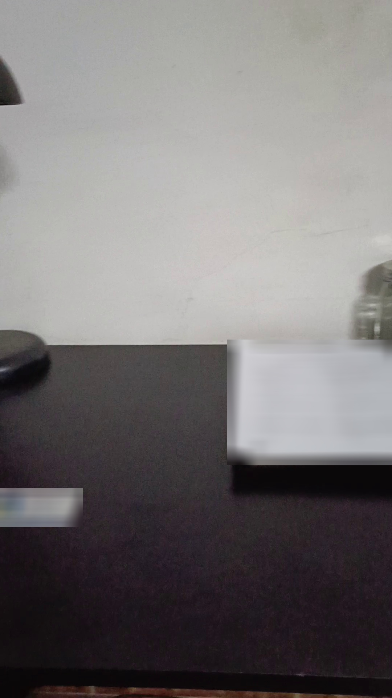
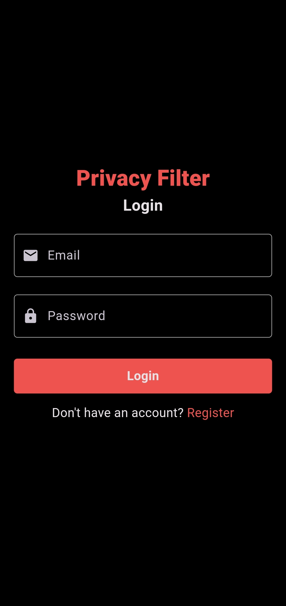
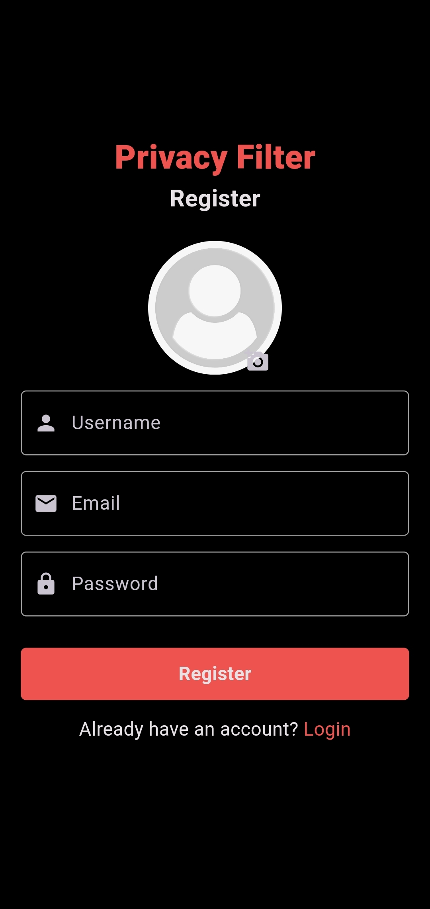
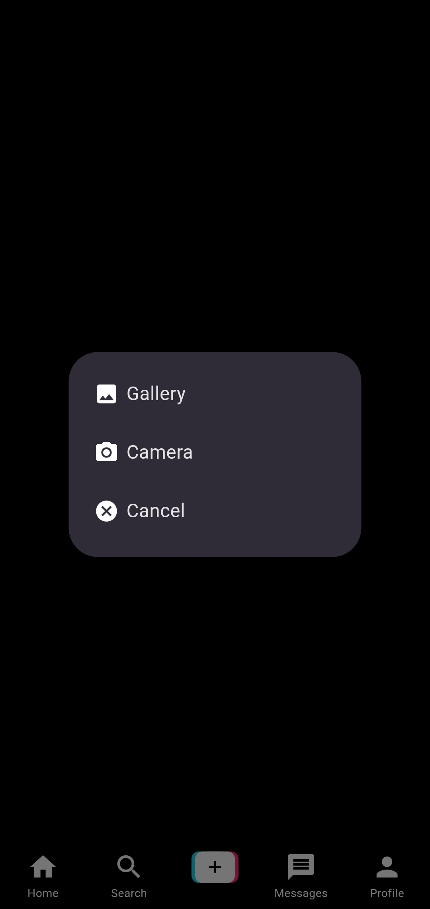
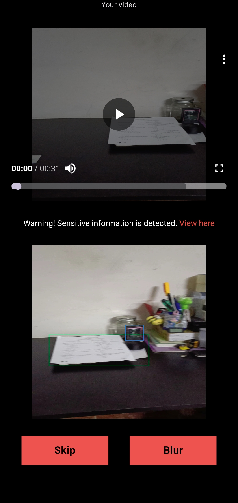
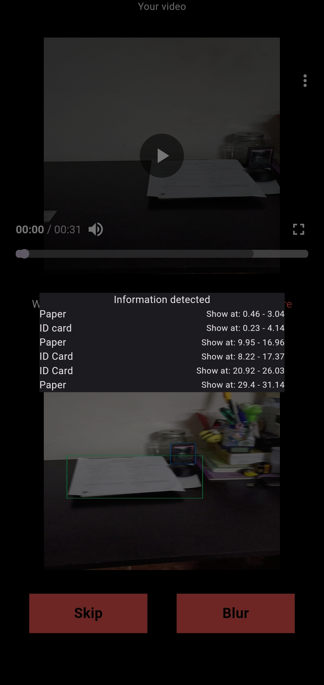
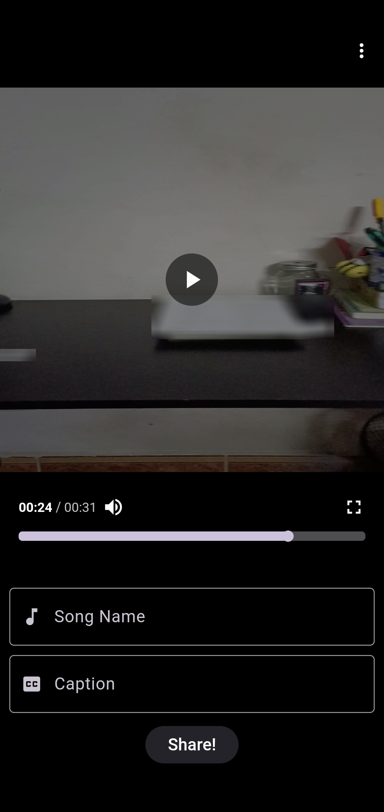

# Tiktok TechJam: PrivacyFilter

## Introduction

This is project for attending Tiktok TechJam in the field of Innovating Privacy with the support of
Image Detection.

## About

- We are a team of five third-year IT students from UET, led by **Nguyen Tuan Duc**, whose insights have greatly influenced our project. **Nguyen Huy Hieu** and **Nguyen Thi Oanh** focused on coding the application, ensuring seamless user experience and integration of the privacy protection system. Meanwhile, **Nguyen Tuan Duc**, **Do Duc Huy**, and **Nguyen Tien Hung** worked on AI models for detecting privacy leaks and user-controlled blurring.
- **Nguyen Huy Hieu** and **Nguyen Thi Oanh** developed the core application with a robust and intuitive interface, integrating privacy features into the video upload process without compromising performance. **Nguyen Tuan Duc**, **Do Duc Huy**, and **Nguyen Tien Hung** worked on advanced computer vision algorithms, integrating their research into the YOLO-World model and optimizing blurring techniques to maintain video quality while obscuring sensitive information.
- Together, we created a comprehensive privacy protection solution that enhances user trust and platform safety, allowing content creators to maintain their creative freedom while safeguarding their privacy.

## Problem Statement

- In the context of TikTok, video uploads often contain unintended privacy-sensitive information such as personal identification documents, credit card numbers, and addresses. This poses significant privacy risks for users, leading to potential misuse of personal data and breaches of privacy.
- Despite existing privacy controls, TikTok lacks an efficient and dynamic system that can identify and protect against these privacy risks in real-time. Users need a solution that not only detects potential privacy leaks but also allows them to control the visibility of sensitive information without disrupting the creative flow of their content.
- To address these concerns, we propose a comprehensive privacy protection system for TikTok, consisting of two main components:
  + Privacy Leakage Detection: Real-time analysis of video frames using advanced computer vision to identify and flag sensitive information.
  + User-Controlled Blurring: An intuitive interface allowing users to review flagged areas and choose which elements to blur, maintaining privacy without compromising video integrity.
- Our goal is to enhance user trust and platform safety by integrating this solution into the video upload process, ensuring that users can confidently share their creative content without compromising their privacy.

## Inspiration

- Our inspiration for developing this privacy protection system on TikTok stems from a deep commitment to enhancing user trust and platform safety in the realm of social media. Recognizing the prevalent issues of unintentional privacy breaches in user-generated content, we were motivated to create a solution that empowers users to maintain control over their personal information without compromising their creative expression.
- Drawing insights from real-world scenarios where sensitive information can inadvertently appear in videos, we aimed to integrate advanced computer vision technologies to detect and flag potential privacy risks in real-time. This approach not only addresses current privacy concerns but also aligns with TikTok's commitment to fostering a safe and respectful community environment.
- Furthermore, our team was inspired by the opportunity to innovate within the intersection of AI, user experience design, and privacy protection. By leveraging cutting-edge algorithms and intuitive user interfaces, we strive to set a new standard in privacy management for video-sharing platforms, ensuring that users can confidently engage with TikTok while safeguarding their personal data.

## Feature

- Sensitive Information Detection
  + First, after installing Yolo-World, we set classes corresponding to sensitive information such as: ID card, paper, house plate number
  + We utilize [yolov8x-worldv2](https://github.com/ultralytics/assets/releases/download/v8.2.0/yolov8x-worldv2.pt) pre-trained weight to detect sensitive information in each frame by drawing the bounding box and showing the id of each object.
  + After that, we use a basic object-tracking algorithm to keep tracking objects in different frames.
- Blur Sensitive Information with Filter
  + Next, the areas inside the bounding boxes in each frame are extracted and blurred by using a low-pass filter. 
- Export list of sensitive information and select to blur
  + We export the information of detected object tracks, including the object's name, id, bounding boxes coordinates, and the time they appear and disappear to a JSON file, then send it to the user client app.

## Results

### Sensitive Information Detection

### Blur Sensitive Information

## Demo

- This is the demo of the application. Click [here](https://youtu.be/IfEcFBgydLY) to see the demo.
- If you find it helpful, please support me. You can give my team a star for support us to join the
  final of this hackathon.

## Screenshots

<table>
  <tr>
    <td>
    
Login screen
    
    </td>
    <td>
    
Register screen
    
    </td>
    <td>
    
Upload screen
    
    </td>
  </tr>
  <tr>
    <td>
    
Detect sensitive information
    
    </td>
    <td>
    
Sensitive info detail screen
    
    </td>
    <td>
    
Blur screen
    
    </td>
  </tr>
</table>

## Technology

- Frontend: Flutter
- Backend: Dart
- Image Detection: Yolo-World
- Database: Firebase

## Installation

To run the application, follow the steps below:

1. Install Flutter
2. Install dependencies by running `flutter pub get`
3. Run the application by running `flutter run`

To run the detection model in a host server:
1. Install the following packages:
  - pip install torch==2.0.1
  - pip install ultralytics
2. Run command: sh privacy_filter.sh
## What to do next

- Our project is focused on segmenting objects that contain personal information, and we are currently exploring different model options to achieve this. We are considering both YOLO world and various few-shot segmentation models like VAT (Volumetric Aggregation Transformer). The challenges we face include improving inference speed and accuracy. Given our limited data, we find few-shot segmentation models particularly appealing. Among the promising models we have identified are VAT and BAM, and we need to determine the best choice for our requirements. This essay will discuss our considerations, the steps we plan to take, and the rationale behind our choices.
- One of the primary considerations in our project is the choice of the model. The YOLO (You Only Look Once) family of models, particularly YOLO world, is known for its speed and efficiency in object detection tasks. YOLO models process images quickly and are efficient in detecting various objects within them. This efficiency makes YOLO world a potentially attractive option for our project, where fast and accurate detection of personal information in objects is crucial. However, YOLO models are primarily designed for object detection rather than segmentation, so we need to evaluate whether the latest iterations in the YOLO world family can adequately meet our segmentation needs or if they would require significant adaptation.
- Given our limited dataset, few-shot segmentation models present a particularly attractive option. These models can perform well with minimal training data, aligning perfectly with our constraints. Few-shot learning allows the model to learn and generalize from just a few examples, making it ideal for tasks where data is scarce. Among the few-shot segmentation models, VAT and BAM have shown significant potential in terms of both speed and accuracy. Evaluating these models will be essential to determine which one best meets our needs while providing the desired balance between performance and efficiency.
- To address the issue of inference speed, we plan to implement several optimization techniques. Model pruning and quantization are two key methods we will use. Pruning involves reducing the size of the model by eliminating redundant parameters and layers, which can enhance inference speed without significantly impacting performance. Quantization, on the other hand, involves converting the model to use lower precision, such as 16-bit or 8-bit precision, which can increase speed and reduce memory usage. These techniques will help us optimize the model for faster inference.
- We will also explore more efficient model architectures, such as MobileNet or EfficientNet, which are designed to provide a good balance between speed and accuracy. Custom modifications to these architectures may further enhance their performance for our specific task. Additionally, leveraging hardware acceleration options like TensorRT for NVIDIA GPUs or OpenVINO for Intel hardware can significantly boost inference speed, making the deployment of the model more efficient.
- Improving the model's accuracy is another crucial aspect of our project. We plan to implement advanced data augmentation techniques to enhance the model’s robustness and generalization capabilities. Regularization techniques, such as dropout, weight decay, and batch normalization, will help prevent overfitting and improve accuracy. Extensive hyperparameter tuning using methods like grid search, random search, or Bayesian optimization will fine-tune the model for optimal performance. Moreover, ensemble methods, which combine predictions from multiple models, can help improve overall accuracy.

## Support

If you have any questions or suggestions, please feel free to contact me
via [email](hhleas03@gmail.com)
